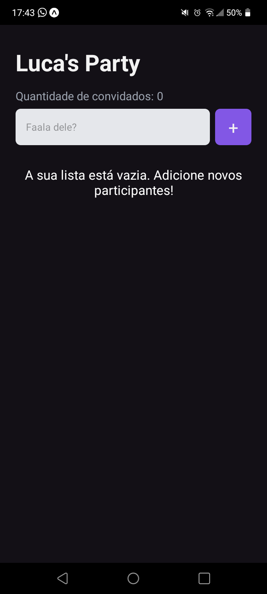
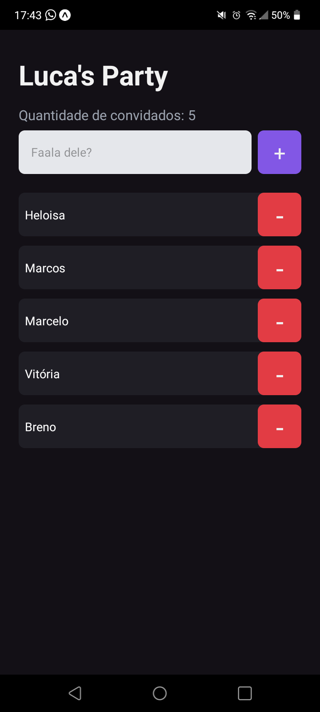
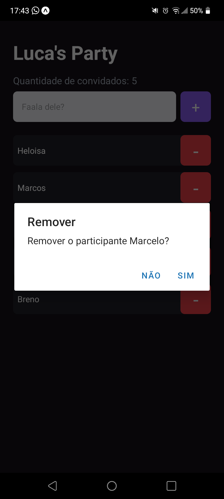

# I'm Here

<p align="center">
    
<span>
    
    .............
    
    .............
    
</span>
    
</p>

> React Native

App construído para treinar e fixar os fundamentos do React Native utilizando o ambiente do Expo. A ideia do app foi de criar uma lista de convidados para alguma festa que o usuário deseja realizar. De certa forma simples, porém praticando bastante os fundamentos.

App built to train and fix the fundamentals of React Native using the Expo environment. The idea of ​​the app was to create a guest list for any party that the user wants to hold. In a simple way, but practicing the fundamentals a lot.

## 🛠 Technologies

- React Native
- TypeScript
- Expo

## 🧑‍💻 Applications

- React Hooks
- Stylesheets
- Flatlist
- Immutability
- Props
- Components

## 🪄 How to use?

### Abra o terminal e copie este repositório em alguma pasta com o comando | Open terminal and copy this repository at some dir with the comand
```
$ git clone https://github.com/lucadboer/im-here-app.git
```

### Acesse a pasta do projeto no prompt de comando ou pelo mouse | Access dir of the project in cmd or by mouse

```
$ cd im-here-app
```

### Instale as dependências da aplicação | Install the dependecies of the application

```
$ npm install
or
$ yarn install
```

### Execute a aplicação | Run the application

```
$ npm start
or
$ yarn start
```

### Baixe o app do expo-go no seu dispositivo móvel neste link: https://expo.dev/client | Download the expo-go app on your mobile device at this link: https://expo.dev/client 

##

### Then scan the QR Code generated in the application directory terminal after running npm start

## 💛 Contact

- Email --> luca.boer@outlook.com
- Linkedin --> https://www.linkedin.com/in/luca-destefano-boer/
- Portfolio --> https://about-luca.vercel.app/
